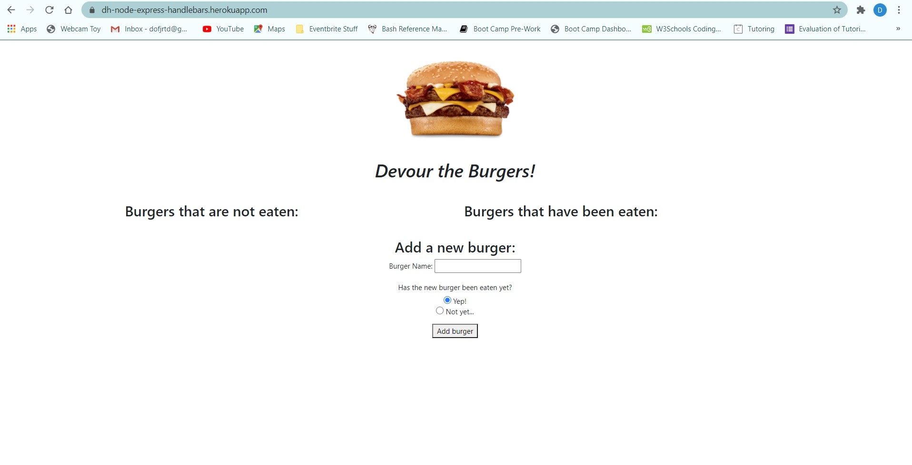
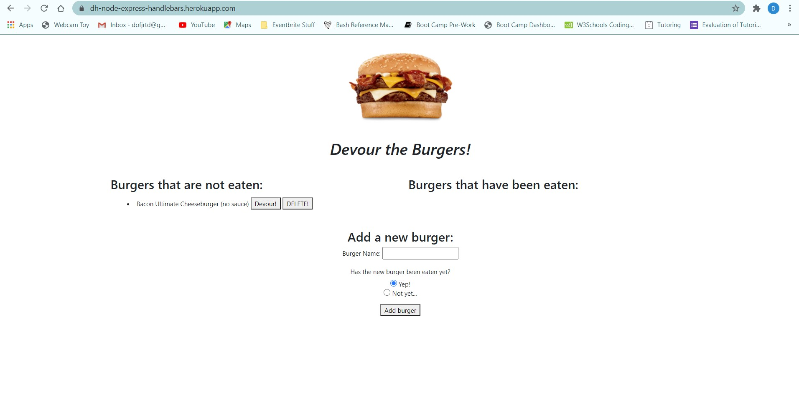
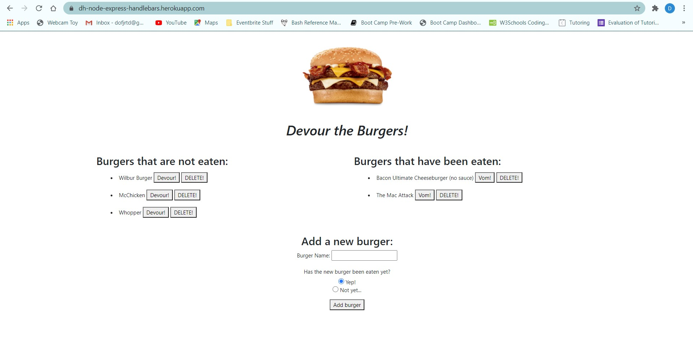

# Node-Express-Handlebars

This application gives the user an input box where they can put in their favorite burgers at an eaten or uneaten status.

Once a burger is added, it populates the database with all of it traits.

The user can do this as many times as they want, as well as change their status of eaten and not eaten, and the app will save all burgers unless deleted.

See instructions folder for assignment details.

